# UIU Social Network - Database Schema

> **Database**: MySQL  
> **Version**: 1.0  
> **Last Updated**: 2026-01-07

---

## Entity Relationship Diagram

```mermaid
erDiagram
    USERS ||--o{ LOST_FOUND_POSTS : creates
    USERS ||--o{ MARKETPLACE_LISTINGS : creates
    USERS ||--o{ RESOURCE_REQUESTS : submits
    USERS ||--o{ RESOURCE_DOWNLOADS : downloads
    USERS ||--o{ SECTION_EXCHANGE_POSTS : creates
    USERS ||--o{ SECTION_REQUESTS : creates
    USERS ||--o{ SECTION_REQUEST_SUPPORTS : supports
    USERS ||--o{ FEEDBACK_POSTS : creates
    USERS ||--o{ CONVERSATIONS : participates
    USERS ||--o{ MESSAGES : sends
    USERS ||--o{ NOTIFICATIONS : receives
    
    DEPARTMENTS ||--o{ USERS : belongs_to
    DEPARTMENTS ||--o{ COURSES : has
    
    COURSES ||--o{ RESOURCES : contains
    COURSES ||--o{ SECTION_EXCHANGE_POSTS : references
    COURSES ||--o{ SECTION_REQUESTS : references
    
    LOST_FOUND_CATEGORIES ||--o{ LOST_FOUND_POSTS : categorizes
    
    MARKETPLACE_CATEGORIES ||--o{ MARKETPLACE_LISTINGS : categorizes
    MARKETPLACE_LISTINGS ||--o{ LISTING_IMAGES : has
    
    RESOURCES ||--o{ RESOURCE_DOWNLOADS : tracked_by
    
    FEEDBACK_POSTS ||--o{ FEEDBACK_IMAGES : has
    FEEDBACK_POSTS ||--o{ ADMIN_RESPONSES : receives
    
    CONVERSATIONS ||--o{ MESSAGES : contains

    USERS {
        int id PK
        string email UK
        string password_hash
        string student_id UK
        string full_name
        int department_id FK
        string batch
        string contact_info
        string profile_picture
        enum role
        boolean is_verified
        boolean is_suspended
        datetime created_at
        datetime updated_at
    }

    DEPARTMENTS {
        int id PK
        string name UK
        string code UK
        datetime created_at
    }

    COURSES {
        int id PK
        string code UK
        string name
        int department_id FK
        string trimester
        datetime created_at
    }

    LOST_FOUND_CATEGORIES {
        int id PK
        string name
        int parent_id FK
        datetime created_at
    }

    LOST_FOUND_POSTS {
        int id PK
        int user_id FK
        int category_id FK
        enum type
        string title
        text description
        string name_on_card
        string card_student_id
        string card_department
        string location
        date date_lost_found
        string image_path
        enum status
        datetime expires_at
        datetime created_at
        datetime updated_at
    }

    MARKETPLACE_CATEGORIES {
        int id PK
        string name UK
        string icon
        datetime created_at
    }

    MARKETPLACE_LISTINGS {
        int id PK
        int user_id FK
        int category_id FK
        string title
        text description
        decimal price
        boolean is_negotiable
        enum listing_type
        string exchange_for
        enum condition_status
        enum status
        datetime expires_at
        datetime created_at
        datetime updated_at
    }

    LISTING_IMAGES {
        int id PK
        int listing_id FK
        string image_path
        int display_order
        datetime created_at
    }

    RESOURCES {
        int id PK
        int course_id FK
        string title
        text description
        string file_path
        bigint file_size
        int download_count
        int uploaded_by FK
        datetime created_at
    }

    RESOURCE_REQUESTS {
        int id PK
        int user_id FK
        int course_id FK
        string resource_name
        text description
        enum status
        string admin_note
        int fulfilled_resource_id FK
        datetime created_at
        datetime updated_at
    }

    RESOURCE_DOWNLOADS {
        int id PK
        int resource_id FK
        int user_id FK
        datetime downloaded_at
    }

    SECTION_EXCHANGE_POSTS {
        int id PK
        int user_id FK
        int course_id FK
        string current_section
        string desired_section
        text note
        enum status
        int approved_by FK
        datetime created_at
        datetime updated_at
    }

    SECTION_REQUESTS {
        int id PK
        int user_id FK
        int course_id FK
        string desired_section
        text reason
        int support_count
        enum status
        int approved_by FK
        datetime created_at
        datetime updated_at
    }

    SECTION_REQUEST_SUPPORTS {
        int id PK
        int request_id FK
        int user_id FK
        datetime created_at
    }

    FEEDBACK_POSTS {
        int id PK
        int user_id FK
        enum feedback_type
        string title
        text content
        boolean is_anonymous
        enum status
        int approved_by FK
        datetime created_at
        datetime updated_at
    }

    FEEDBACK_IMAGES {
        int id PK
        int feedback_id FK
        string image_path
        datetime created_at
    }

    ADMIN_RESPONSES {
        int id PK
        int feedback_id FK
        int admin_id FK
        text response
        datetime created_at
    }

    CONVERSATIONS {
        int id PK
        int user1_id FK
        int user2_id FK
        datetime last_message_at
        datetime created_at
    }

    MESSAGES {
        int id PK
        int conversation_id FK
        int sender_id FK
        text content
        boolean is_read
        datetime created_at
    }

    NOTIFICATIONS {
        int id PK
        int user_id FK
        enum type
        string title
        text message
        string link
        boolean is_read
        datetime created_at
    }

    SYSTEM_SETTINGS {
        int id PK
        string setting_key UK
        string setting_value
        datetime updated_at
    }

    VERIFICATION_TOKENS {
        int id PK
        int user_id FK
        string token UK
        enum type
        datetime expires_at
        datetime created_at
    }
```



---

## Detailed Table Schemas

### 1. users
Stores all registered user accounts.

```sql
CREATE TABLE users (
    id INT PRIMARY KEY AUTO_INCREMENT,
    email VARCHAR(255) NOT NULL UNIQUE,
    password_hash VARCHAR(255) NOT NULL,
    student_id VARCHAR(20) NOT NULL UNIQUE,
    full_name VARCHAR(100) NOT NULL,
    department_id INT NOT NULL,
    batch VARCHAR(20),
    contact_info VARCHAR(100),
    profile_picture VARCHAR(255),
    role ENUM('admin', 'moderator', 'student') NOT NULL DEFAULT 'student',
    is_verified BOOLEAN NOT NULL DEFAULT FALSE,
    is_suspended BOOLEAN NOT NULL DEFAULT FALSE,
    created_at DATETIME NOT NULL DEFAULT CURRENT_TIMESTAMP,
    updated_at DATETIME NOT NULL DEFAULT CURRENT_TIMESTAMP ON UPDATE CURRENT_TIMESTAMP,
    FOREIGN KEY (department_id) REFERENCES departments(id)
);

CREATE INDEX idx_users_email ON users(email);
CREATE INDEX idx_users_student_id ON users(student_id);
CREATE INDEX idx_users_department ON users(department_id);
CREATE INDEX idx_users_role ON users(role);
```

---

### 2. departments
University departments for organizing users and courses.

```sql
CREATE TABLE departments (
    id INT PRIMARY KEY AUTO_INCREMENT,
    name VARCHAR(100) NOT NULL UNIQUE,
    code VARCHAR(10) NOT NULL UNIQUE,
    created_at DATETIME NOT NULL DEFAULT CURRENT_TIMESTAMP
);
```

**Sample Data:**
```sql
INSERT INTO departments (name, code) VALUES
('Computer Science & Engineering', 'CSE'),
('Electrical & Electronic Engineering', 'EEE'),
('Business Administration', 'BBA'),
('Civil Engineering', 'CE'),
('Economics', 'ECO'),
('English', 'ENG');
```

---

### 3. courses
Predefined list of courses organized by department and trimester.

```sql
CREATE TABLE courses (
    id INT PRIMARY KEY AUTO_INCREMENT,
    code VARCHAR(20) NOT NULL UNIQUE,
    name VARCHAR(150) NOT NULL,
    department_id INT NOT NULL,
    trimester VARCHAR(20) NOT NULL,
    created_at DATETIME NOT NULL DEFAULT CURRENT_TIMESTAMP,
    FOREIGN KEY (department_id) REFERENCES departments(id)
);

CREATE INDEX idx_courses_department ON courses(department_id);
CREATE INDEX idx_courses_trimester ON courses(trimester);
```

---

### 4. lost_found_categories
Categories and subcategories for lost and found items.

```sql
CREATE TABLE lost_found_categories (
    id INT PRIMARY KEY AUTO_INCREMENT,
    name VARCHAR(50) NOT NULL,
    parent_id INT NULL,
    created_at DATETIME NOT NULL DEFAULT CURRENT_TIMESTAMP,
    FOREIGN KEY (parent_id) REFERENCES lost_found_categories(id)
);
```

**Sample Data:**
```sql
INSERT INTO lost_found_categories (name, parent_id) VALUES
('ID Card', NULL),
('Items', NULL),
('Electronics', 2),
('Books', 2),
('Accessories', 2),
('Bags', 2),
('Documents', 2),
('Other', 2);
```

---

### 5. lost_found_posts
Posts for lost and found items.

```sql
CREATE TABLE lost_found_posts (
    id INT PRIMARY KEY AUTO_INCREMENT,
    user_id INT NOT NULL,
    category_id INT NOT NULL,
    type ENUM('lost', 'found') NOT NULL,
    title VARCHAR(150) NOT NULL,
    description TEXT,
    -- ID Card specific fields
    name_on_card VARCHAR(100),
    card_student_id VARCHAR(20),
    card_department VARCHAR(100),
    -- Common fields
    location VARCHAR(200) NOT NULL,
    date_lost_found DATE NOT NULL,
    image_path VARCHAR(255),
    status ENUM('lost', 'found', 'claimed', 'returned') NOT NULL,
    expires_at DATETIME NOT NULL,
    created_at DATETIME NOT NULL DEFAULT CURRENT_TIMESTAMP,
    updated_at DATETIME NOT NULL DEFAULT CURRENT_TIMESTAMP ON UPDATE CURRENT_TIMESTAMP,
    FOREIGN KEY (user_id) REFERENCES users(id) ON DELETE CASCADE,
    FOREIGN KEY (category_id) REFERENCES lost_found_categories(id)
);

CREATE INDEX idx_lf_posts_user ON lost_found_posts(user_id);
CREATE INDEX idx_lf_posts_category ON lost_found_posts(category_id);
CREATE INDEX idx_lf_posts_type ON lost_found_posts(type);
CREATE INDEX idx_lf_posts_status ON lost_found_posts(status);
CREATE INDEX idx_lf_posts_expires ON lost_found_posts(expires_at);
CREATE INDEX idx_lf_posts_created ON lost_found_posts(created_at);
```

---

### 6. marketplace_categories
Categories for marketplace listings.

```sql
CREATE TABLE marketplace_categories (
    id INT PRIMARY KEY AUTO_INCREMENT,
    name VARCHAR(50) NOT NULL UNIQUE,
    icon VARCHAR(50),
    created_at DATETIME NOT NULL DEFAULT CURRENT_TIMESTAMP
);
```

**Sample Data:**
```sql
INSERT INTO marketplace_categories (name, icon) VALUES
('Books', 'book'),
('Electronics', 'laptop'),
('Clothing', 'shirt'),
('Accessories', 'watch'),
('Stationery', 'pencil'),
('Sports', 'football'),
('Others', 'box');
```

---

### 7. marketplace_listings
Items listed for sale or exchange.

```sql
CREATE TABLE marketplace_listings (
    id INT PRIMARY KEY AUTO_INCREMENT,
    user_id INT NOT NULL,
    category_id INT NOT NULL,
    title VARCHAR(150) NOT NULL,
    description TEXT NOT NULL,
    price DECIMAL(10, 2),
    is_negotiable BOOLEAN NOT NULL DEFAULT FALSE,
    listing_type ENUM('sale', 'exchange', 'both') NOT NULL DEFAULT 'sale',
    exchange_for TEXT,
    condition_status ENUM('new', 'like_new', 'good', 'fair') NOT NULL,
    status ENUM('active', 'sold', 'exchanged', 'expired', 'deleted') NOT NULL DEFAULT 'active',
    expires_at DATETIME NOT NULL,
    created_at DATETIME NOT NULL DEFAULT CURRENT_TIMESTAMP,
    updated_at DATETIME NOT NULL DEFAULT CURRENT_TIMESTAMP ON UPDATE CURRENT_TIMESTAMP,
    FOREIGN KEY (user_id) REFERENCES users(id) ON DELETE CASCADE,
    FOREIGN KEY (category_id) REFERENCES marketplace_categories(id)
);

CREATE INDEX idx_mp_listings_user ON marketplace_listings(user_id);
CREATE INDEX idx_mp_listings_category ON marketplace_listings(category_id);
CREATE INDEX idx_mp_listings_status ON marketplace_listings(status);
CREATE INDEX idx_mp_listings_type ON marketplace_listings(listing_type);
CREATE INDEX idx_mp_listings_created ON marketplace_listings(created_at);
```

---

### 8. listing_images
Images for marketplace listings (up to 5 per listing).

```sql
CREATE TABLE listing_images (
    id INT PRIMARY KEY AUTO_INCREMENT,
    listing_id INT NOT NULL,
    image_path VARCHAR(255) NOT NULL,
    display_order TINYINT NOT NULL DEFAULT 0,
    created_at DATETIME NOT NULL DEFAULT CURRENT_TIMESTAMP,
    FOREIGN KEY (listing_id) REFERENCES marketplace_listings(id) ON DELETE CASCADE
);

CREATE INDEX idx_listing_images_listing ON listing_images(listing_id);
```

---

### 9. resources
PDF resources uploaded by admin.

```sql
CREATE TABLE resources (
    id INT PRIMARY KEY AUTO_INCREMENT,
    course_id INT NOT NULL,
    title VARCHAR(200) NOT NULL,
    description TEXT,
    file_path VARCHAR(255) NOT NULL,
    file_size BIGINT NOT NULL,
    download_count INT NOT NULL DEFAULT 0,
    uploaded_by INT NOT NULL,
    created_at DATETIME NOT NULL DEFAULT CURRENT_TIMESTAMP,
    FOREIGN KEY (course_id) REFERENCES courses(id),
    FOREIGN KEY (uploaded_by) REFERENCES users(id)
);

CREATE INDEX idx_resources_course ON resources(course_id);
CREATE INDEX idx_resources_downloads ON resources(download_count);
```

---

### 10. resource_requests
Student requests for resource uploads.

```sql
CREATE TABLE resource_requests (
    id INT PRIMARY KEY AUTO_INCREMENT,
    user_id INT NOT NULL,
    course_id INT NOT NULL,
    resource_name VARCHAR(200) NOT NULL,
    description TEXT,
    status ENUM('pending', 'approved', 'rejected', 'uploaded') NOT NULL DEFAULT 'pending',
    admin_note TEXT,
    fulfilled_resource_id INT,
    created_at DATETIME NOT NULL DEFAULT CURRENT_TIMESTAMP,
    updated_at DATETIME NOT NULL DEFAULT CURRENT_TIMESTAMP ON UPDATE CURRENT_TIMESTAMP,
    FOREIGN KEY (user_id) REFERENCES users(id) ON DELETE CASCADE,
    FOREIGN KEY (course_id) REFERENCES courses(id),
    FOREIGN KEY (fulfilled_resource_id) REFERENCES resources(id)
);

CREATE INDEX idx_resource_requests_user ON resource_requests(user_id);
CREATE INDEX idx_resource_requests_status ON resource_requests(status);
```

---

### 11. resource_downloads
Tracks who downloaded which resource.

```sql
CREATE TABLE resource_downloads (
    id INT PRIMARY KEY AUTO_INCREMENT,
    resource_id INT NOT NULL,
    user_id INT NOT NULL,
    downloaded_at DATETIME NOT NULL DEFAULT CURRENT_TIMESTAMP,
    FOREIGN KEY (resource_id) REFERENCES resources(id) ON DELETE CASCADE,
    FOREIGN KEY (user_id) REFERENCES users(id) ON DELETE CASCADE
);

CREATE INDEX idx_resource_downloads_resource ON resource_downloads(resource_id);
CREATE INDEX idx_resource_downloads_user ON resource_downloads(user_id);
```

---

### 12. section_exchange_posts
Posts for section exchange requests.

```sql
CREATE TABLE section_exchange_posts (
    id INT PRIMARY KEY AUTO_INCREMENT,
    user_id INT NOT NULL,
    course_id INT NOT NULL,
    current_section VARCHAR(10) NOT NULL,
    desired_section VARCHAR(10) NOT NULL,
    note TEXT,
    status ENUM('pending', 'approved', 'rejected', 'completed') NOT NULL DEFAULT 'pending',
    approved_by INT,
    created_at DATETIME NOT NULL DEFAULT CURRENT_TIMESTAMP,
    updated_at DATETIME NOT NULL DEFAULT CURRENT_TIMESTAMP ON UPDATE CURRENT_TIMESTAMP,
    FOREIGN KEY (user_id) REFERENCES users(id) ON DELETE CASCADE,
    FOREIGN KEY (course_id) REFERENCES courses(id),
    FOREIGN KEY (approved_by) REFERENCES users(id)
);

CREATE INDEX idx_section_exchange_user ON section_exchange_posts(user_id);
CREATE INDEX idx_section_exchange_course ON section_exchange_posts(course_id);
CREATE INDEX idx_section_exchange_status ON section_exchange_posts(status);
```

---

### 13. section_requests
Requests for new section creation.

```sql
CREATE TABLE section_requests (
    id INT PRIMARY KEY AUTO_INCREMENT,
    user_id INT NOT NULL,
    course_id INT NOT NULL,
    desired_section VARCHAR(10) NOT NULL,
    reason TEXT NOT NULL,
    support_count INT NOT NULL DEFAULT 0,
    status ENUM('pending', 'approved', 'rejected') NOT NULL DEFAULT 'pending',
    approved_by INT,
    created_at DATETIME NOT NULL DEFAULT CURRENT_TIMESTAMP,
    updated_at DATETIME NOT NULL DEFAULT CURRENT_TIMESTAMP ON UPDATE CURRENT_TIMESTAMP,
    FOREIGN KEY (user_id) REFERENCES users(id) ON DELETE CASCADE,
    FOREIGN KEY (course_id) REFERENCES courses(id),
    FOREIGN KEY (approved_by) REFERENCES users(id)
);

CREATE INDEX idx_section_requests_user ON section_requests(user_id);
CREATE INDEX idx_section_requests_course ON section_requests(course_id);
CREATE INDEX idx_section_requests_status ON section_requests(status);
```

---

### 14. section_request_supports
Tracks users who support section requests.

```sql
CREATE TABLE section_request_supports (
    id INT PRIMARY KEY AUTO_INCREMENT,
    request_id INT NOT NULL,
    user_id INT NOT NULL,
    created_at DATETIME NOT NULL DEFAULT CURRENT_TIMESTAMP,
    FOREIGN KEY (request_id) REFERENCES section_requests(id) ON DELETE CASCADE,
    FOREIGN KEY (user_id) REFERENCES users(id) ON DELETE CASCADE,
    UNIQUE KEY unique_support (request_id, user_id)
);
```

---

### 15. feedback_posts
General issues and canteen/food feedback.

```sql
CREATE TABLE feedback_posts (
    id INT PRIMARY KEY AUTO_INCREMENT,
    user_id INT NOT NULL,
    feedback_type ENUM('general', 'canteen') NOT NULL,
    title VARCHAR(200) NOT NULL,
    content TEXT NOT NULL,
    is_anonymous BOOLEAN NOT NULL DEFAULT FALSE,
    status ENUM('pending', 'approved', 'rejected') NOT NULL DEFAULT 'pending',
    approved_by INT,
    created_at DATETIME NOT NULL DEFAULT CURRENT_TIMESTAMP,
    updated_at DATETIME NOT NULL DEFAULT CURRENT_TIMESTAMP ON UPDATE CURRENT_TIMESTAMP,
    FOREIGN KEY (user_id) REFERENCES users(id) ON DELETE CASCADE,
    FOREIGN KEY (approved_by) REFERENCES users(id)
);

CREATE INDEX idx_feedback_user ON feedback_posts(user_id);
CREATE INDEX idx_feedback_type ON feedback_posts(feedback_type);
CREATE INDEX idx_feedback_status ON feedback_posts(status);
CREATE INDEX idx_feedback_created ON feedback_posts(created_at);
```

---

### 16. feedback_images
Images for canteen/food feedback (up to 3 per post).

```sql
CREATE TABLE feedback_images (
    id INT PRIMARY KEY AUTO_INCREMENT,
    feedback_id INT NOT NULL,
    image_path VARCHAR(255) NOT NULL,
    created_at DATETIME NOT NULL DEFAULT CURRENT_TIMESTAMP,
    FOREIGN KEY (feedback_id) REFERENCES feedback_posts(id) ON DELETE CASCADE
);

CREATE INDEX idx_feedback_images_feedback ON feedback_images(feedback_id);
```

---

### 17. admin_responses
Admin responses to feedback posts.

```sql
CREATE TABLE admin_responses (
    id INT PRIMARY KEY AUTO_INCREMENT,
    feedback_id INT NOT NULL,
    admin_id INT NOT NULL,
    response TEXT NOT NULL,
    created_at DATETIME NOT NULL DEFAULT CURRENT_TIMESTAMP,
    FOREIGN KEY (feedback_id) REFERENCES feedback_posts(id) ON DELETE CASCADE,
    FOREIGN KEY (admin_id) REFERENCES users(id)
);

CREATE INDEX idx_admin_responses_feedback ON admin_responses(feedback_id);
```

---

### 18. conversations
Direct message conversations between two users.

```sql
CREATE TABLE conversations (
    id INT PRIMARY KEY AUTO_INCREMENT,
    user1_id INT NOT NULL,
    user2_id INT NOT NULL,
    last_message_at DATETIME,
    created_at DATETIME NOT NULL DEFAULT CURRENT_TIMESTAMP,
    FOREIGN KEY (user1_id) REFERENCES users(id) ON DELETE CASCADE,
    FOREIGN KEY (user2_id) REFERENCES users(id) ON DELETE CASCADE,
    UNIQUE KEY unique_conversation (user1_id, user2_id)
);

CREATE INDEX idx_conversations_user1 ON conversations(user1_id);
CREATE INDEX idx_conversations_user2 ON conversations(user2_id);
CREATE INDEX idx_conversations_last_message ON conversations(last_message_at);
```

---

### 19. messages
Individual messages within conversations.

```sql
CREATE TABLE messages (
    id INT PRIMARY KEY AUTO_INCREMENT,
    conversation_id INT NOT NULL,
    sender_id INT NOT NULL,
    content TEXT NOT NULL,
    is_read BOOLEAN NOT NULL DEFAULT FALSE,
    created_at DATETIME NOT NULL DEFAULT CURRENT_TIMESTAMP,
    FOREIGN KEY (conversation_id) REFERENCES conversations(id) ON DELETE CASCADE,
    FOREIGN KEY (sender_id) REFERENCES users(id) ON DELETE CASCADE
);

CREATE INDEX idx_messages_conversation ON messages(conversation_id);
CREATE INDEX idx_messages_sender ON messages(sender_id);
CREATE INDEX idx_messages_created ON messages(created_at);
CREATE INDEX idx_messages_unread ON messages(is_read);
```

---

### 20. notifications
In-app notifications for users.

```sql
CREATE TABLE notifications (
    id INT PRIMARY KEY AUTO_INCREMENT,
    user_id INT NOT NULL,
    type ENUM(
        'message_received',
        'post_approved',
        'post_rejected',
        'item_claimed',
        'request_update',
        'feedback_response',
        'post_expiring',
        'exchange_interest',
        'general'
    ) NOT NULL,
    title VARCHAR(100) NOT NULL,
    message TEXT NOT NULL,
    link VARCHAR(255),
    is_read BOOLEAN NOT NULL DEFAULT FALSE,
    created_at DATETIME NOT NULL DEFAULT CURRENT_TIMESTAMP,
    FOREIGN KEY (user_id) REFERENCES users(id) ON DELETE CASCADE
);

CREATE INDEX idx_notifications_user ON notifications(user_id);
CREATE INDEX idx_notifications_read ON notifications(is_read);
CREATE INDEX idx_notifications_created ON notifications(created_at);
```

---

### 21. system_settings
System configuration settings.

```sql
CREATE TABLE system_settings (
    id INT PRIMARY KEY AUTO_INCREMENT,
    setting_key VARCHAR(50) NOT NULL UNIQUE,
    setting_value TEXT NOT NULL,
    updated_at DATETIME NOT NULL DEFAULT CURRENT_TIMESTAMP ON UPDATE CURRENT_TIMESTAMP
);
```

**Initial Settings:**
```sql
INSERT INTO system_settings (setting_key, setting_value) VALUES
('section_issue_enabled', 'false'),
('post_expiration_days', '30'),
('max_listing_images', '5'),
('max_feedback_images', '3'),
('max_file_size_mb', '50');
```

---

### 22. verification_tokens
Tokens for email verification and password reset.

```sql
CREATE TABLE verification_tokens (
    id INT PRIMARY KEY AUTO_INCREMENT,
    user_id INT NOT NULL,
    token VARCHAR(255) NOT NULL UNIQUE,
    type ENUM('email_verification', 'password_reset') NOT NULL,
    expires_at DATETIME NOT NULL,
    created_at DATETIME NOT NULL DEFAULT CURRENT_TIMESTAMP,
    FOREIGN KEY (user_id) REFERENCES users(id) ON DELETE CASCADE
);

CREATE INDEX idx_tokens_token ON verification_tokens(token);
CREATE INDEX idx_tokens_user ON verification_tokens(user_id);
CREATE INDEX idx_tokens_expires ON verification_tokens(expires_at);
```

---

## Complete SQL Script

For convenience, here is the complete database creation script:

```sql
-- Create Database
CREATE DATABASE IF NOT EXISTS uiu_social_network;
USE uiu_social_network;

-- Run all CREATE TABLE statements above in order
-- (departments first, then users, then dependent tables)
```

---

## Relationships Summary

| Parent Table | Child Table | Relationship | On Delete |
|--------------|-------------|--------------|-----------|
| departments | users | One-to-Many | RESTRICT |
| departments | courses | One-to-Many | RESTRICT |
| users | lost_found_posts | One-to-Many | CASCADE |
| users | marketplace_listings | One-to-Many | CASCADE |
| users | resource_requests | One-to-Many | CASCADE |
| users | feedback_posts | One-to-Many | CASCADE |
| users | messages | One-to-Many | CASCADE |
| users | notifications | One-to-Many | CASCADE |
| courses | resources | One-to-Many | RESTRICT |
| courses | section_exchange_posts | One-to-Many | RESTRICT |
| courses | section_requests | One-to-Many | RESTRICT |
| marketplace_listings | listing_images | One-to-Many | CASCADE |
| feedback_posts | feedback_images | One-to-Many | CASCADE |
| feedback_posts | admin_responses | One-to-Many | CASCADE |
| conversations | messages | One-to-Many | CASCADE |
| section_requests | section_request_supports | One-to-Many | CASCADE |
| resources | resource_downloads | One-to-Many | CASCADE |

---

*This schema document provides the complete database structure for the UIU Social Network project. All tables include appropriate indexes for query optimization.*
